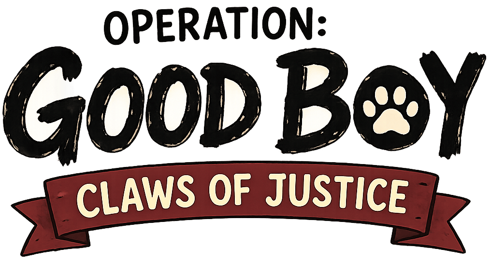

# Operation: Good Boy — Claws of Justice



> *Three cats. One mission. Zero teamwork skills.*

A co-op browser deck-builder for 2–4 players. The neighborhood is under siege. Good Boy is loose. Cucumbers are appearing everywhere. It's up to a ragtag team of extremely motivated (and extremely uncoordinated) cats to stop him.

---

## The Story

It started, as most neighborhood crises do, with a dog.

Good Boy — a golden retriever of suspiciously innocent demeanor — has been terrorizing the area. Lady Fluffington III hasn't slept in three weeks. Ace's favorite sun patch has been claimed. Noodle's squeaky toy is *gone*. This cannot stand.

Three cats. Different grievances. Questionable teamwork. One mission.

---

## The Characters

### 😤 Lady Fluffington III — *The Persian*
A tortoiseshell Persian of impeccable breeding and absolutely unquestionable importance. She arrived on the battlefield not because she was asked — she simply decided. Serene. Entitled. Unstoppable.

**Passive:** When taking damage, generate 1 charm attack.

---

### 😎 Ace — *The Street Cat*
Scrappy, lean, and weathered in all the right ways. Ace had claimed that sunny patch in Good Boy's garden fair and square. Now that spot is gone. This isn't just a mission — it's personal. Resourceful. Cool. Always lands on their feet.

**Passive:** Draw 1 extra card at the start of each turn.

---

### 🐱 Noodle — *The Chaos Kitten*
Approximately five brain cells, all pointed at one thing: that squeaky toy. Good Boy took it. Noodle does not understand strategy or self-preservation, but she is extremely enthusiastic, and honestly? That might be enough. Chaotic. Tiny. Absolutely feral.

**Passive:** When buying a card, gain 1 pawcoin refund.

---

## How to Play

- Players take turns revealing events, managing enemy abilities, playing cards from their hand, attacking enemies, and buying new cards from the shop
- Enemies drop cucumbers on locations when their abilities trigger — fill up a location and it's lost
- Lose all three locations and it's defeat
- Fight through the enemy deck to reach Good Boy — defeat him and the neighborhood is saved

---

## Tech Stack

- **Frontend**: React + Vite + Tailwind CSS
- **Backend**: Node.js + Express + Socket.IO
- **Realtime**: Socket.IO for multiplayer sync
- **Hosting**: Vercel (frontend) + Render (backend)

---

## Running Locally

### Prerequisites
- Node.js 18+

### Backend
```bash
cd backend
npm install
node src/index.js
```
Runs on `http://localhost:3001`

### Frontend
```bash
cd frontend
npm install
npm run dev
```
Runs on `http://localhost:5173`

Make sure the backend is running first. The frontend connects to `localhost:3001` by default in development.

---

## Project Status

The game is playable end-to-end with full multiplayer support. Currently working on:
- Playtesting and refining game mechanics
- Card, event, and enemy content (names, effects, flavor text)
- Visual design polish
- A 4th playable character

*This project is in active development. Expect things to change.*
